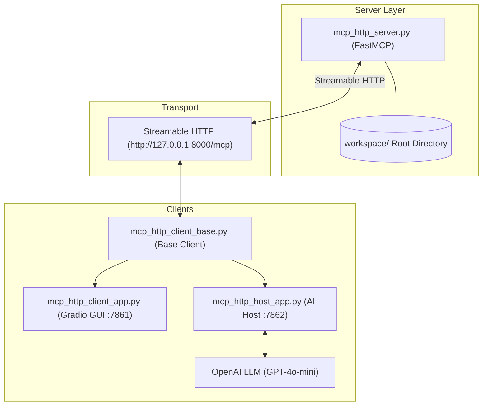

# Advanced MCP Applications with Streamable HTTP, Roots, and Sampling

An advanced Model Context Protocol (MCP) reference implementation demonstrating remote HTTP connectivity, security boundaries (Roots), resource templates, prompt management, and server-initiated LLM sampling.

---

## 🏛 Architecture Overview



---

## 📂 Project Structure

| File | Role & Description |
| :--- | :--- |
| [`mcp_http_client_base.py`] | **Base Client**: Core asynchronous client managing `ClientSession`, `AsyncExitStack`, and Streamable HTTP transport for tools, resources, and prompts. |
| [`mcp_http_server.py`] | **MCP Server**: FastMCP HTTP server with workspace root sandboxing, file tools (`read_file`, `write_file`, `list_files`), resources, prompt templates, and sampling simulation. |
| [`mcp_http_client_app.py`] | **Gradio GUI Client**: Interactive manual interface for inspecting and calling server tools, reading resources, and rendering prompts. |
| [`mcp_http_host_app.py`] | **AI Host Application**: Intelligent agent combining OpenAI function calling with dynamic MCP tool dispatching and conversational chatbot UI. |
| [`dependencies.txt`] | **Dependencies**: Required Python package versions. |

---

## 🚀 Quickstart Guide

### 1. Installation

Install all required dependencies:

```bash
pip install -r dependencies.txt
```

### 2. Start the HTTP MCP Server

The server provides Streamable HTTP endpoints and enforces file operations within the `workspace/` folder:

```bash
python mcp_http_server.py
```
*Server runs at `http://127.0.0.1:8000` with endpoint at `/mcp`.*

### 3. Launch the GUI Client App

Open the manual interactive client:

```bash
python mcp_http_client_app.py http://127.0.0.1:8000 ./workspace
```
*Access the Gradio UI at `http://127.0.0.1:7861`.*

### 4. Launch the AI Host Application

Make sure your `OPENAI_API_KEY` is configured in your environment:

```bash
# Set OpenAI API key (PowerShell)
$env:OPENAI_API_KEY = "your-api-key-here"

# Start the host app
python mcp_http_host_app.py http://127.0.0.1:8000 ./workspace
```
*Access the AI Host Chatbot at `http://127.0.0.1:7862`.*

---

## 🔑 Key MCP Concepts

### 1. Streamable HTTP Transport
Allows remote client-server communication using Server-Sent Events (SSE) and HTTP POST requests rather than traditional local `stdio` subprocesses.

### 2. Workspace Roots & Sandboxing
The server enforces path resolution checks via `is_within_roots()`, preventing directory traversal attacks and restricting all file reads/writes strictly to the allowed workspace boundary.

### 3. Resources & Prompts
- **Resources**: Exposes static or parameterized content (e.g., `file://workspace/{filename}`) for client retrieval.
- **Prompts**: Server-defined prompt templates (e.g., `review_code`, `analyze_security`) that standardize common AI workflow patterns.

### 4. Sampling
Demonstrates how an MCP server can request LLM completions from the client through standard JSON-RPC `sampling/createMessage` calls with human-in-the-loop approvals.
